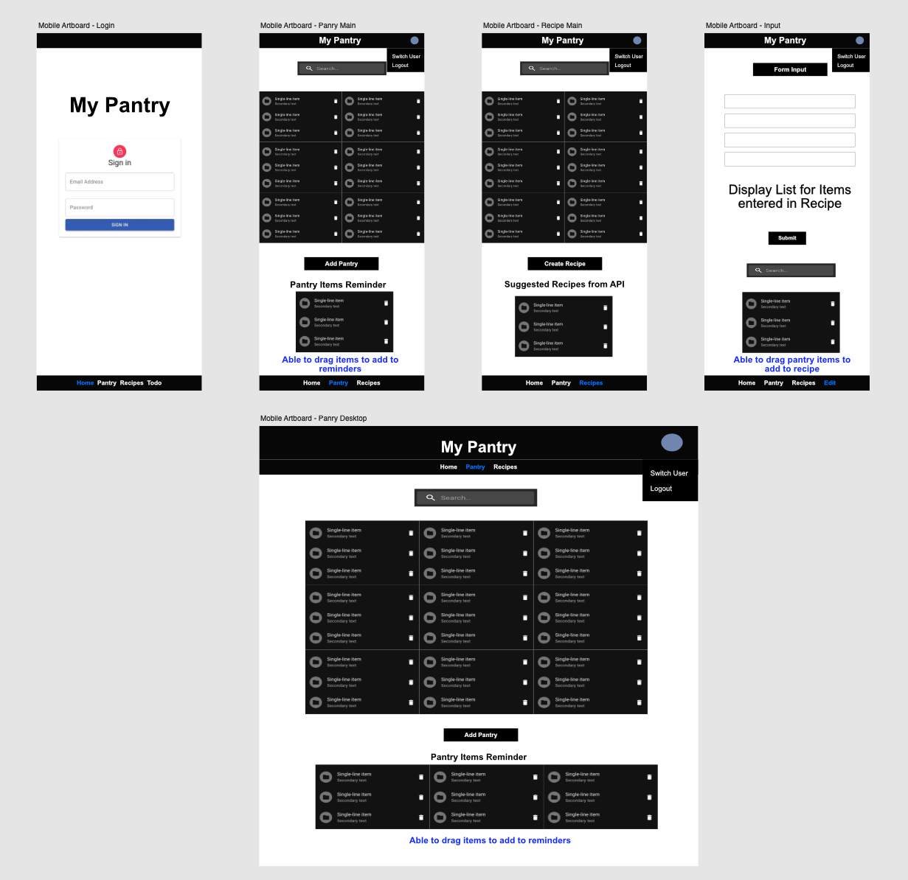

<!-- TABLE OF CONTENTS -->

  
Table of Contents

  <ol>
    <li>
      <a href="#about-the-project">About The Project</a>
      <ul>
        <li><a href="#wireframes">Wireframes</a></li>
        <li><a href="#dependencies">Dependencies</a></li>
      </ul>
    </li>
    <li>
      <a href="#planning">Planning</a>
      <ul>
        <li><a href="#schedule">Schedule</a></li>
        <li><a href="#tasks">Tasks</a></li>
      </ul>
    </li>
    <li><a href="#additional-info">Additional Info</a></li>
  </ol>

 

<!-- ABOUT THE PROJECT -->
## About the Project
### My Pantry

As of 2023, the <cite>[US Bureau of Labor Statistics][1]</cite> data shows the annual inflation is currently more than double the average prior to 2021.  <cite>[Forberg 2022][2]</cite> points out that one-third of the food that families buy every year makes it way into the garbage.  Now is not the time to be wasting food with the uncertainties of the job market and rising food prices.  

Have you found yourself accidentally buying extra perishables and now forcing you to overcook.  Are you generally using a note app on your phone to track you grocery list?  Need something that can do a little more like help track when a favorite pantry item is getting low.  My Pantry is convenient as your notepad that just does a little more.  That "little more" will help reduce your food waste and save you money at the grocery.  With an easy to use interface, you can track you favorite pantry items and recipes all in one site - no app downloads necessary.

[1]: https://www.usinflationcalculator.com/inflation/current-inflation-rates/
[2]: https://finance.yahoo.com/news/average-household-wastes-over-1-220000160.html

 

### Wireframes

Material UI samples were used in wireframes.  A mobile web view is the focus for the project as it's intended to be used on-the-go and replace a simple notepad app.

 

### Dependencies

* React
* React Router Dom
* Firebase
* Formik
* Material UI
* React DND
* API for Recipes (www.edamam.com)

 

<!-- PLANNING -->
## Planning

 

### Schedule
Week1 - Create tests and begin working on project 
Week2 - Complete working project by end of week 
Week3 - Refactoring and add optional features 

 

### Tasks
* Setup React project `npx create-react-app my-app`
* Setup React Router DOM `npm install react-router-dom`
* Setup Material UI `npm install @mui/material @emotion/react @emotion/styled`
* Setup Material UI Icons `npm install @mui/icons-material`
* Setup FirebaseUI React Components `npm install react-firebaseui` && `npm install firebase`
* Setup Formik `npm install formik`
* Setup React DND `npm install react-dnd react-dnd-html5-backend`
* Determine CRUD for data
  * Pantry items
  * Recipe items
* Create App Layout
  * Navigation header
  * Navigation footer (mobile view)
* Create Components
  * Search bar
  * List item cards
    * Allow drag and drop
  * Item drop area
* Create Home page (Logged Out)
  * Setup Login
* Create Main Page - Dashboard
  * List of user inputted grocery items
  * List of favorite pantry ingredients that are running low or out of stock
  * List of favorite recipes with ingredients available in pantry
* Create Pantry items page
  * List of favorite pantry ingredients that are running low or out of stock
  * Form to add/edit/delete pantry item
* Create Recipe page
  * List of favorite recipes with ingredients available in pantry
  * Form to add/edit/delete recipe item
  * API Feature - List recipe suggestions base on meat selection
  * (Optional Feature) Sorted list of recipes based on amounts of ingredients available in pantry
    * Ingredient type to affect priority score (i.e. Chicken to have higher score versus condiments)
* Create User input list page
  * List of user to do list for items not storing in the pantry or as recipe
  * Form to manage to do list

 

<!-- Additional Info -->
## Additional Info

Created by Chris Salvador

Project Link: TBA 
Project Repo Link: [https://github.com/UWC2-JSCRIPT/320-final-project-csalvador58](https://github.com/UWC2-JSCRIPT/320-final-project-csalvador58)

 

(<a href="#readme-top">back to top</a>)
